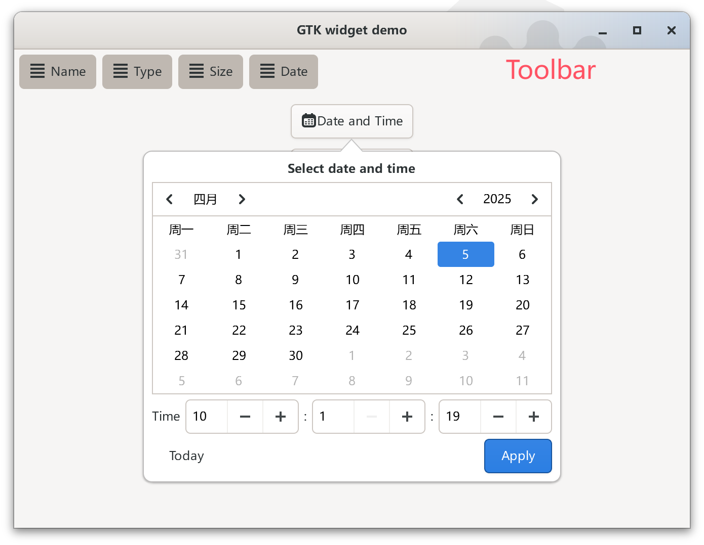

# GtkWidgetDemo
This is a GtkWidget derived widget demo app for demonstrating the GTK4 features for [Kangaroo App](https://www.datatable.online/?from=github), that is a database client and admin tool built with GTK, libgda and Vala.

The GtkWidgetDemo app integrates with following GTK4 features:
1. Vala language
2. I18N support
3. GTK resources
4. GtkWidget derived widget
5. GtkWidget derived widget with template support
6. Toolbar with context menu support
7. Date & time picker

# Screenshot

